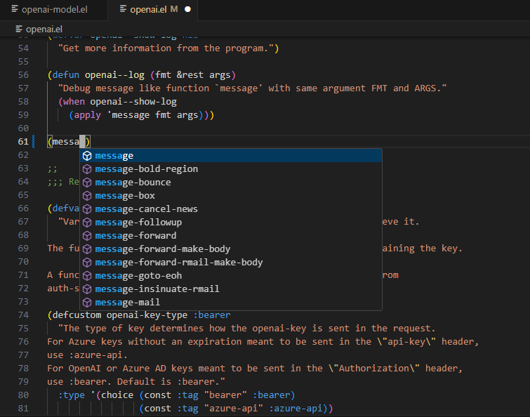
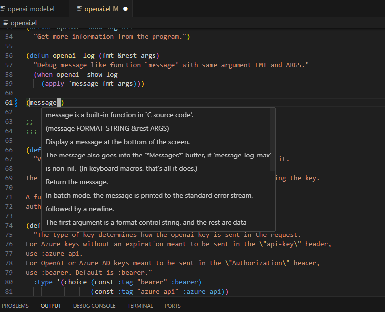
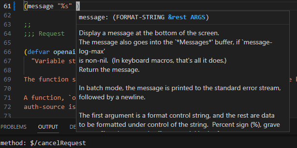

[](https://www.gnu.org/licenses/gpl-3.0)
[](https://jcs-emacs.github.io/jcs-elpa/#/ellsp)

# Ellsp
> Elisp Language Server

[](https://github.com/jcs-elpa/ellsp/actions/workflows/test-elisp.yml)
[](https://github.com/jcs-elpa/ellsp/actions/workflows/test-vscode.yml)

This software is designed to be used with editors other than Emacs. If you are
an Emacs user already, I prefer you use Emacs directly.

Here is the list of currently supported editors:

- [Emacs]() (`M-x ellsp-register`)
- [VSCode](https://marketplace.visualstudio.com/items?itemName=jcs090218.Ellsp)

## 🖼️ Gallery

### Completion



### Hover



### Signature Help



## 🔧 Prerequisites

Before installation, make sure you have all the following software installed!

- [Emacs](https://www.gnu.org/software/emacs/)
- [Eask](https://github.com/emacs-eask/cli)

## 💾 Installation

Add these lines to your `Eask`-file:

```elisp
(source 'jcs-elpa)

(development
 (depends-on "ellsp"))
```

Then install the language server:

```sh
# Install ellsp package
$ eask install-deps --dev

# Install the language server
$ eask exec install-ellsp
```

To test to see if the server installed successfully, execute the following command:

### Linux

```sh
$ eask exec ellsp-linux
```

### macOS

```sh
$ eask exec ellsp-macos
```

### Windows

```sh
$ eask exec ellsp-win.exe
```

## 🔗 References

- [Language Server Protocol Specification](https://microsoft.github.io/language-server-protocol/specifications/lsp/3.17/specification/)
- [Elsa](https://github.com/emacs-elsa/Elsa)

## Contribute

[](http://makeapullrequest.com)
[](https://github.com/bbatsov/emacs-lisp-style-guide)
[](https://www.paypal.me/jcs090218)
[](https://www.patreon.com/jcs090218)

If you would like to contribute to this project, you may either
clone or make pull requests to this repository. Or you can
clone the project and establish your branch of this tool.
Any methods are welcome!
