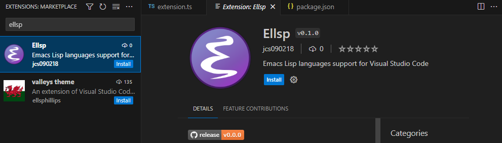

# vscode-ellsp
> Emacs Lisp languages support for Visual Studio Code

## 💾 Installation

Install the [Ellsp][] extension directly from the [VSCode Marketplace][].

Then follow the instructions [here](https://github.com/jcs090218/ellsp#-installation)
to install the language server! 🎉

## 📇 Commands

| Commands      | Description                        |
|:--------------|:-----------------------------------|
| `ellsp.start` | Start the `shader langauge server` |
| `ellsp.stop`  | Stop the `shader langauge server`  |

[Ellsp]: https://marketplace.visualstudio.com/items?itemName=jcs090218.Ellsp
[VSCode Marketplace]: https://marketplace.visualstudio.com/vscode
